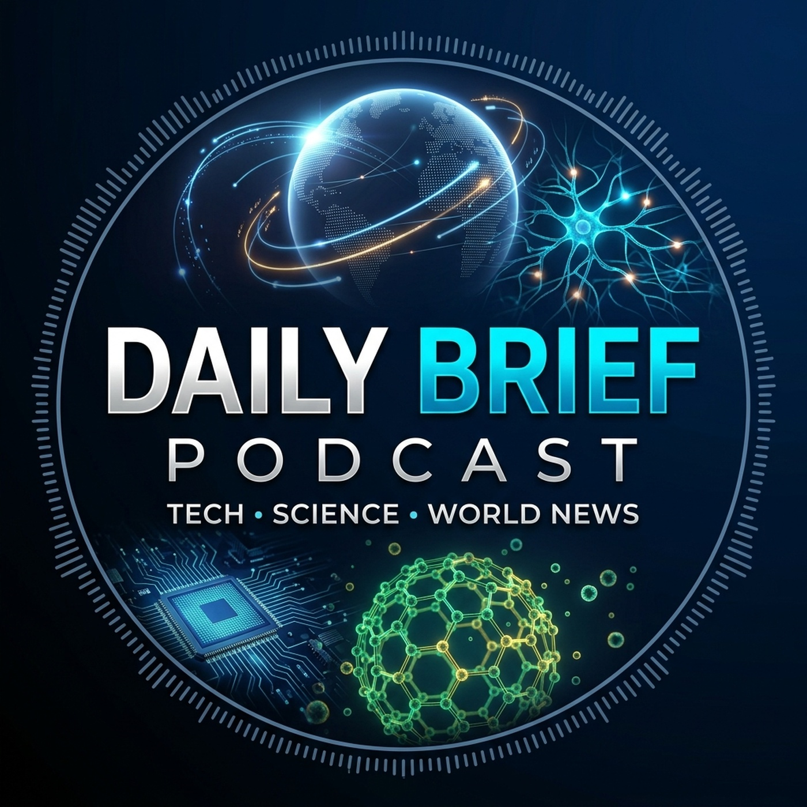

# Daily Brief Podcast

<p align="center">
  
</p>

> Daily automated audio briefings synthesizing the top breakthroughs across technology, science, and world news.

---

## 🎙️ Podcast Feed

Subscribe to the podcast via RSS in your favorite podcast player (Apple Podcasts, Pocket Casts, Overcast, Spotify, etc.):

```text
https://RightHandedMonkey.github.io/daily-brief-output/feed.xml
```

---

## 🌐 The Three Core Pillars

Each daily briefing synthesizes critical insights from three primary domains:

* **🌍 World & Geopolitical News (1440 Daily Digest)**: Measured, objective, and non-partisan reporting covering major global headlines, policy shifts, economic developments, and societal events. Delivered with authoritative broadcast journalism precision.
* **⚡ Tech & Artificial Intelligence (TLDR Tech)**: Punchy, high-signal coverage of frontier AI models, developer infrastructure, autonomous agent frameworks, silicon architecture, and software engineering.
* **🔬 Nanotechnology & Deep Science (Science X Research Brief)**: Groundbreaking laboratory breakthroughs in nanoscale robotics, molecular biology, protein design, acoustic manipulation, and advanced physics.

---

## 🤖 Audio Production & Automation

* **Generation Engine**: Multi-source automated email ingestion via Google Workspace MCP and custom LLM synthesis.
* **Voice Model**: Gemini Neural TTS (`Fenrir`, `Sadachbia`, `Aoede`).
* **Hosting**: Distributed podcast distribution via GitHub Pages.
